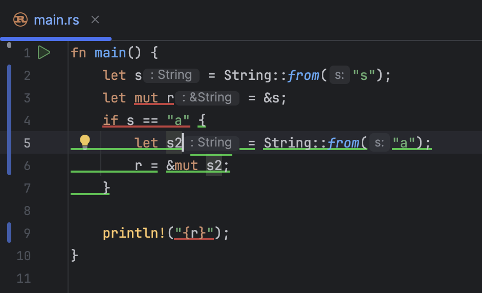

# RustOwl Plugin for IntelliJ IDEs

This is an IDE-specific port of [RustOwl](https://github.com/cordx56/rustowl) for IntelliJ IDEs.

## Prerequisites

- JetBrains IDE 2024.3 or later

> [!NOTE]
> This plugin cannot be installed on Community IDEs as the plugin is built on top of the official LSP integration,
> which is only available in paid IDEs.

> [!NOTE]
> Using on RustRover is recommended, though this plugin also works on other IDEs (without the paid Rust plugin).

## Usage

- Make sure [RustOwl](https://github.com/cordx56/rustowl) is installed and on the PATH.</li>
- Install this plugin to your IDE.</li>
- Open Rust files and move the cursor to the identifier.</li>

## Roadmap

- [x] Customise colours for highlighting
- [x] Customise location of cargo-owlsp
